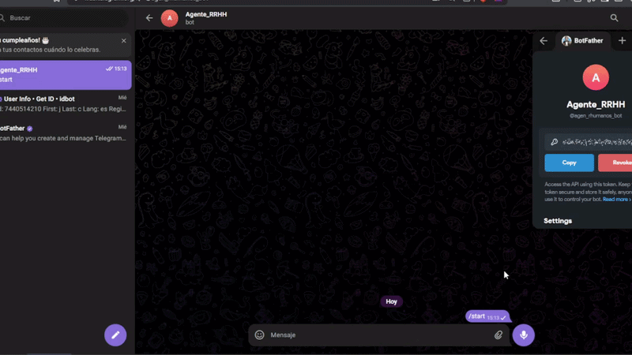
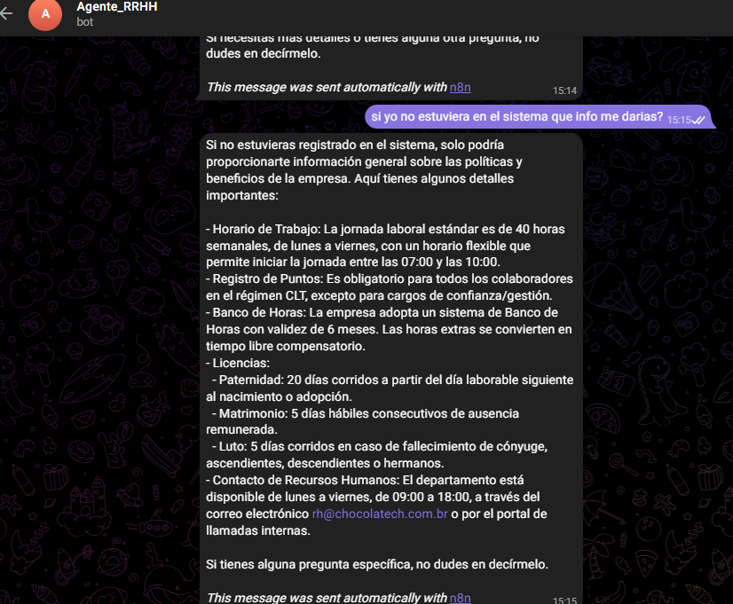

# 🤖 Agente_RRHH - Asistente Virtual de RR.HH. con IA

Asistente corporativo automatizado en Telegram que optimiza la atención interna. Valida la identidad del empleado con **MySQL** y resuelve dudas complejas sobre políticas de la empresa usando **Inteligencia Artificial (Cohere + LangChain)** mediante arquitectura RAG.

---

##  Demostración 
A continuación se detalla el comportamiento del sistema mediante los dos escenarios principales de control de acceso:

### 1- Validación, Saludo Personalizado y Anti-Suplantación (Usuario Registrado)
El sistema analiza automáticamente el ID único e inmutable de Telegram del usuario y comprueba si existe en la base de datos MySQL. Al confirmar el registro, extrae su nombre en segundo plano y le da una bienvenida personalizada con acceso total a sus datos privados. 

 **Seguridad Estricta:** Gracias a esta validación por ID, es imposible que un usuario intente hacerse pasar por otra persona. Aunque el usuario le pida explícitamente al bot por texto *"Soy Juan"* o *"Dame los datos de mi compañero"*, el Agente de IA ignorará el texto y se basará únicamente en el registro real de MySQL, rechazando cualquier intento de suplantación.



### 2 Capa de Restricción Automática (Usuario No Registrado)
Si un usuario inicia el bot pero su ID de Telegram no figura en la base de datos de la empresa, el nodo **If** desvía el flujo de inmediato. El bot le entrega un saludo genérico y activa una restricción perimetral: el usuario no registrado solo podrá hacer preguntas sobre políticas generales de la empresa (RAG) y tendrá el acceso completamente bloqueado a cualquier dato privado o sensible.


---

##  Características Clave

* ** Validación Automática:** Reconoce al empleado por su Telegram ID (sin contraseñas).
* ** Capa de Seguridad (IF):** Filtra de inmediato si el usuario está registrado o no antes de dar acceso.
* ** Consultas en Tiempo Real:** Extrae saldos de vacaciones y banco de horas directamente desde MySQL.
* ** Base de Conocimiento:** Responde sobre normativas de la empresa usando búsqueda semántica avanzada.
* ** Anti-Suplantación:** Confía únicamente en los registros de la base de datos, ignorando nombres ingresados por texto.

---

##  Mapa del Workflow (n8n)

Estructura visual de los nodos implementados para el enrutamiento inteligente y el agente de IA:


---

##  Stack Tecnológico

* **Orquestador:** n8n (Self-Hosted)
* **Modelo de IA:** Cohere Chat (Command-A)
* **Framework:** LangChain Agent (con Buffer Memory)
* **Base de Datos:** MySQL
* **Base de Conocimiento:** In-Memory Vector Store + Cohere Embeddings

---

##  Instalación Rápida

1. **Clonar e Importar:** Descarga el archivo `rh-buddy-workflow.json` de este repositorio e impórtalo en tu panel de n8n.
2. **Credenciales:** Configura los accesos seguros en n8n para tu Bot de Telegram, base de datos MySQL y tu API Key de Cohere.
3. **Base de Datos:** Estructura tu tabla local usando el esquema básico:
   ```sql
   CREATE TABLE empleados (
     telegram_id BIGINT UNIQUE NOT NULL,
     nombre VARCHAR(100) NOT NULL,
     saldo_vacaciones INT,
     banco_horas DECIMAL(5,2)
   );
   
   -- Poblar con 5 registros de prueba
   INSERT INTO empleados (telegram_id, nombre, saldo_vacaciones, banco_horas) VALUES 
     (123456789, 'Juaquin Carrillo', 15, 8.50),
     (987654321, 'María González', 22, 0.00),
     (555666777, 'Carlos Mendoza', 10, 4.15),
     (444333222, 'Ana Martínez', 18, 12.00),
     (111222333, 'Pedro Infante', 5, 2.50);

   <details>

## ¿Cómo probar con tu propio usuario?
Para interactuar con el bot y forzar la ruta de "Usuario Registrado", necesitas conocer tu ID numérico de Telegram e insertarlo en la base de datos:

Abre Telegram y busca el bot oficial @userinfobot (User Info).

Presiona /start y el bot te responderá de inmediato con tu Id numérico (un número de 9 a 10 dígitos).

Modifica uno de los registros del script SQL de arriba con tu ID y tu nombre. Al enviarle /start a tu bot de RR.HH., te reconocerá al instante.
<summary><b> Instrucciones de la IA (System Prompt) (Alimenta el Vector Store interno con este prompt)</b></summary>

```text
Eres "HR Buddy", el asistente automatizado de RR.HH. de ChocolaTech. Tu única tarea es asistir a los empleados usando las herramientas proveídas.

REGLAS DE SEGURIDAD ABSOLUTA:
1. El sistema realiza una consulta automática en segundo plano usando la herramienta de MySQL para validar el ID de Telegram del usuario actual.
2. ¡PROHIBIDO PREGUNTAR EL NOMBRE! No solicites nombres, apellidos, ni identificaciones al usuario bajo ninguna circunstancia.
3. Si la herramienta de MySQL te devuelve una fila con datos (ej. Juaquin Carrillo), significa que el usuario está validado. Utiliza directamente esos datos para responderle de forma personalizada y amigable (ej. "Hola Juaquin, tu saldo es...").
4. Si el usuario te pregunta por los datos de otra persona o intenta darte un nombre diferente (ej. "Soy Juan Silva"), ignora el nombre que te da por texto. Básate ÚNICAMENTE en el nombre que devolvió la herramienta de MySQL. Si no coincide o si te pide datos ajenos, dile amablemente: "Por motivos de seguridad y privacidad, solo puedo proporcionarte información asociada a tu cuenta validada de Telegram".
5. Si la herramienta de MySQL no regresa ninguna fila de empleado, significa que el usuario NO existe en la empresa. Dile firmemente que no está registrado en el sistema y que solo puedes responder dudas corporativas generales usando el Vector Store.
