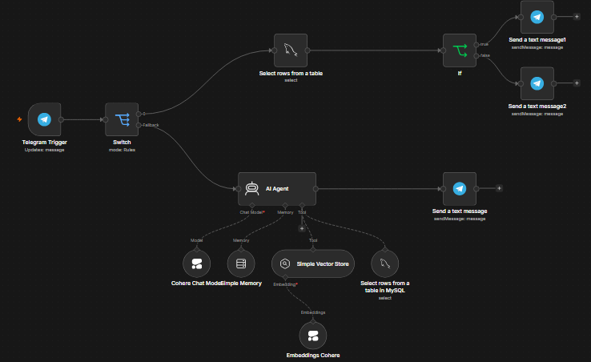

# 🤖 Agente_RRHH - Asistente Virtual de RR.HH. con IA

Asistente corporativo automatizado en Telegram que optimiza la atención interna. Valida la identidad del empleado con **MySQL** y resuelve dudas complejas sobre políticas de la empresa usando **Inteligencia Artificial (Cohere + LangChain)** mediante arquitectura RAG.

---

##  Demostración en Vivo

Así interactúa el empleado con **HR Buddy**. El sistema valida su identidad en segundos y responde con contexto en tiempo real:


---

##  Características Clave

* ** Validación Automática:** Reconoce al empleado por su Telegram ID (sin contraseñas).
* ** Capa de Seguridad (IF):** Filtra de inmediato si el usuario está registrado o no antes de dar acceso.
* ** Consultas en Tiempo Real:** Extrae saldos de vacaciones y banco de horas directamente desde MySQL.
* ** Base de Conocimiento:** Responde sobre normativas de la empresa usando búsqueda semántica avanzada.
* ** Anti-Suplantación:** Confía únicamente en los registros de la base de datos, ignorando nombres ingresados por texto.

---

##  Mapa del Workflow (n8n)

Estructura visual de los nodos implementados para el enrutamiento inteligente y el agente de IA:



---

##  Stack Tecnológico

* **Orquestador:** n8n (Self-Hosted)
* **Modelo de IA:** Cohere Chat (Command-A)
* **Framework:** LangChain Agent (con Buffer Memory)
* **Base de Datos:** MySQL
* **Base de Conocimiento:** In-Memory Vector Store + Cohere Embeddings

---

##  Instalación Rápida

1. **Clonar e Importar:** Descarga el archivo `workflow.json` de este repositorio e impórtalo en tu panel de n8n.
2. **Credenciales:** Configura los accesos en n8n para tu Bot de Telegram, base de datos MySQL y API Key de Cohere.
3. **Base de Datos:** Estructura tu tabla local usando el esquema básico:
   ```sql
   CREATE TABLE empleados (
     telegram_id BIGINT UNIQUE NOT NULL,
     nombre VARCHAR(100) NOT NULL,
     saldo_vacaciones INT,
     banco_horas DECIMAL(5,2)
   );
